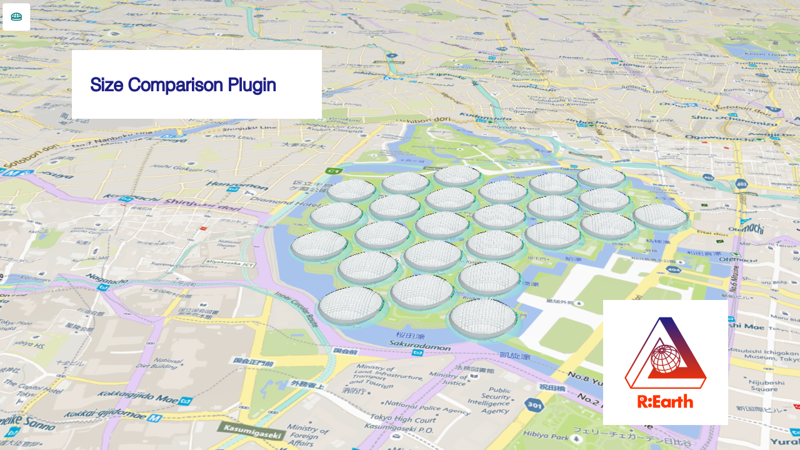
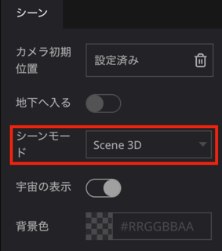
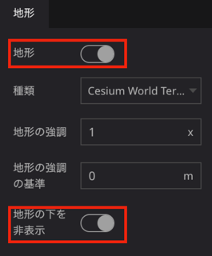
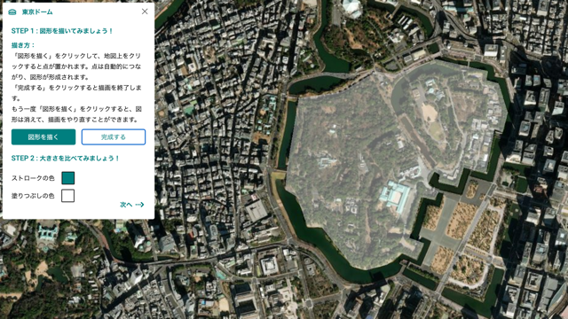
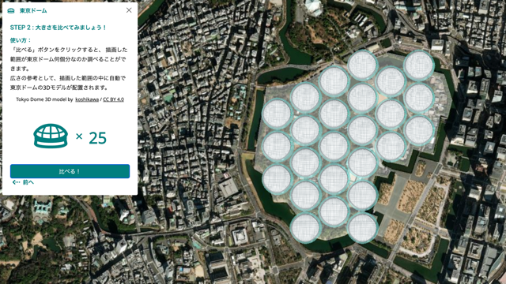

# 大きさ比較 プラグイン

Tokyo Dome 3D model by [koshikawa](https://sketchfab.com/koshikawa "author") /  [CC-BY 4.0](https://creativecommons.org/licenses/by/4.0/  "license")

## このプラグインについて
- 指定した領域に東京ドームの3Dモデルを並べることで、任意の場所の広さを視覚的に表現します。
　
## 使用方法
### 右パネルの設定項目
３Dモデルを正しく表示するためには以下の設定を行ってください。

- シーン設定 
   - シーンタブのシーンモードで ”Scene 3D" を選択します。
    
   - 地形タブの、”地形” と ”地形の下を非表示” 両方をONにします。
     
    
### 操作方法
- 初期画面

     初期画面の「はじめる！」ボタンを押して開始します。
     
     
    
- STEP1

     東京ドームを配置する領域を指定します。「図形を描く」ボタンを押すと領域指定モードになります。指定する領域に沿ってマウスの左ボタンをクリックし、領域を指定していきます。「完成する」ボタンを押すと領域指定モードを終了し、領域を確定します。「ストロークの色」、「塗りつぶしの色」は任意のタイミングで変更可能です。もう一度「図形を描く」ボタンをクリックすると、作成した図形は消えて、描画をやり直すことができます。
     以下の図は皇例に領域を指定した例です。皇居の面積は約1,150,000平方メートルで、東京ドーム 46,755平方メートルの約25倍に相当します。
　　 
    
- STEP2

     「比べる」ボタンを押すと指定した領域が東京ドームの何倍か計算し、３Dモデルを配置します。「前へ」ボタンを押すとSTEP1の画面に戻ります。
　　 

### 留意点
- 指定した領域の形状によっては、３Dモデルがはみ出したり、領域に余白が生じたりします。これらの誤差を無くすことは出来ませんので、ご理解の上、本プラグインをご利用ください。

## 備考
- テストブラウザ環境
  - OS:Mac OS Montery 12.6.5
  - ブラウザ：Google Chrome 112.0.5615.121

## 開発者欄

このプラグインは、Re:Earth公式プラグインです。

 

ソースコードはこちら(https://github.com/eukarya-inc/reearth-plugin-size-comparison)

- コミュニティ

  - このプラグインを利用したプロジェクトをユーザーコミュニティでシェアしましょう。

  - このプラグインについての不明点がある場合にもここからRe:Earthチームや他の開発者に質問することができます。

  - Discordへのリンクはこちら(https://discord.gg/BXcQhvwqqM)
